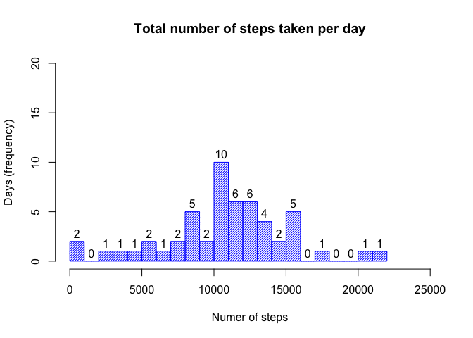

# Reproducible Research: Peer Assessment 1

###Step1: Loading and preprocessing the data


```r
unzip("activity.zip", files = NULL, list = FALSE, overwrite = TRUE,junkpaths = FALSE, exdir = ".", unzip = "internal",setTimes = FALSE)
activity_df <- read.csv("activity.csv", header = TRUE,sep =",",stringsAsFactors = FALSE)
#closeAllConnections()
```

Checking what type of variables do we have:

```r
names(activity_df)
```

```
## [1] "steps"    "date"     "interval"
```

Checking how many observations are there and what type of data do we have:

```r
str(activity_df)
```

```
## 'data.frame':	17568 obs. of  3 variables:
##  $ steps   : int  NA NA NA NA NA NA NA NA NA NA ...
##  $ date    : chr  "2012-10-01" "2012-10-01" "2012-10-01" "2012-10-01" ...
##  $ interval: int  0 5 10 15 20 25 30 35 40 45 ...
```

And let's look at the summary of data:

```r
summary(activity_df)
```

```
##      steps            date              interval     
##  Min.   :  0.00   Length:17568       Min.   :   0.0  
##  1st Qu.:  0.00   Class :character   1st Qu.: 588.8  
##  Median :  0.00   Mode  :character   Median :1177.5  
##  Mean   : 37.38                      Mean   :1177.5  
##  3rd Qu.: 12.00                      3rd Qu.:1766.2  
##  Max.   :806.00                      Max.   :2355.0  
##  NA's   :2304
```

It looks like the data is tidy so we don't need to do any additional pre-processing. But some records are missing the steps data. Let's see how many of such records do we have:

```r
sum(is.na(as.numeric(activity_df$steps)))
```

```
## [1] 2304
```

As we can see, there is about one fifth of observations that has missing values for the number of steps but we will decide how to replace missing values later.

For now, we will just remove all incomplete cases:

```r
df_cc<-activity_df[complete.cases(activity_df),]
str(df_cc)
```

```
## 'data.frame':	15264 obs. of  3 variables:
##  $ steps   : int  0 0 0 0 0 0 0 0 0 0 ...
##  $ date    : chr  "2012-10-02" "2012-10-02" "2012-10-02" "2012-10-02" ...
##  $ interval: int  0 5 10 15 20 25 30 35 40 45 ...
```
As a result, the dimension of the original dataframe has been reduced.

###Step2: Calculating the mean number of steps taken per day

For this part of the assignment, we will ignore the missing values in the dataset.

(Alternative!! Cleaning the data first: 

df<-activity_df[complete.cases(activity_df),]
df_mean<-aggregate(as.numeric(df$steps),list(df$date),mean)
df_median<-aggregate(as.numeric(df$steps),list(df$date),median)
df_total<-aggregate(as.numeric(df$steps),list(df$date),FUN=sum)
)

```r
df_mean<-aggregate(as.numeric(df_cc$steps),list(df_cc$date),mean)
#head(df$mean)
head(df_mean[,2])
```

```
## [1]  0.43750 39.41667 42.06944 46.15972 53.54167 38.24653
```
We could have done this calculation on the original dataset (witout omitting the NAs) and we would have received the same result (one could try applying the same code to the original data set activity_df). But in this case a warning message saying that NAs have been introduced by coercion would have appeared.


Calculating the median number of steps taken per day. For this part of the assignment, we will also ignore the missing values in the dataset, i.e. apply this operation to the clean dataset.

```r
df_median<-aggregate(as.numeric(df_cc$steps),list(df_cc$date),median)
#head(df$median)
head(df_median[,2])
```

```
## [1] 0 0 0 0 0 0
```


###Step3: Calculating the total number of steps taken per day


```r
df_total<-aggregate(as.numeric(activity_df$steps),list(activity_df$date),FUN=sum)
#adding appropriate labels to the data frame
colnames(df_total) <- c("date", "total number of steps")
head(df_total[,2])
```

```
## [1]    NA   126 11352 12116 13294 15420
```

```r
# why this one doesn't work??
#library(dplyr)
#df_total2<-activity_df %>%
#     group_by(date) %>%
#     summarize(total_steps=sum(as.numeric(activity_df$steps), na.rm=TRUE))
    
#alternative
#df_t<-group_by(activity_df,date)
#df_total3<-summarize(df_t,total=sum(as.numeric(activity_df$steps),na.rm=TRUE))
#summary(df_total3)
```

The histogram representation of the results gives us the following picture:
 

###Step 4: Defining the average daily activity pattern

In order to define the average daily activity pattern, we wil make a time series plot (i.e. type = "l") of the 5-minute intervals (x-axis) and the average number of  steps taken, averaged across all days (y-axis).


And then we will make a time series plot (i.e. type = "l") of the 5-minute intervals (x-axis) and the averaged number of  steps taken (y-axis):
 

#Which 5-minute interval, on average across all the days in the dataset, contains the maximum number   of steps?

###Step 5: Imputing missing values


Note that there are a number of days/intervals where there are missing values (coded as NA). The presence of missing days may introduce bias into some calculations or summaries of the data.

Calculate and report the total number of missing values in the dataset (i.e. the total number of rows #with NAs)

Devise a strategy for filling in all of the missing values in the dataset. The strategy does not need #to be sophisticated. For example, you could use the mean/median for that day, or the mean for that 5#-minute interval, etc.

Create a new dataset that is equal to the original dataset but with the missing data filled in.

###Step 6: Making a histogram of the total number of steps taken each day after missing values were imputed

Make a histogram of the total number of steps taken each day and Calculate and report the mean and median total number of steps taken per day. Do these values differ from the estimates from the first part of the assignment? What is the impact of imputing missing data on the estimates of the total daily number of steps?


###Step 7: Activity patterns on weekdays vs. weekends

Are there differences in activity patterns between weekdays and weekends?
For this part the weekdays() function may be of some help here. Use the dataset with the filled-in missing values for this part.

Create a new factor variable in the dataset with two levels – “weekday” and “weekend” indicating whether a given date is a weekday or weekend day.

Make a panel plot containing a time series plot (i.e. type = "l") of the 5-minute interval (x-axis) and the average number of steps taken, averaged across all weekday days or weekend days (y-axis). 

See the README file in the GitHub repository to see an example of what this plot should look like using simulated data.
